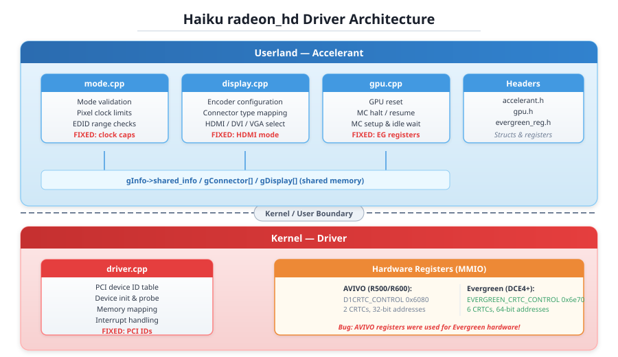
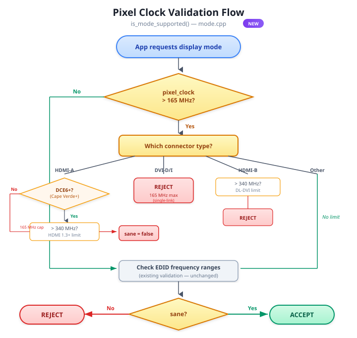

# Radeon HD Driver Fix: Garbled Display on Cedar/Evergreen HDMI

**Branch:** `RadeonDriverFix`  
**Commit:** `0dbe85ae56` — *radeon_hd: Fix garbled display on Cedar/Evergreen HDMI*  
**Date:** 2026-04-14  
**Author:** Kevin Adams (with Claude Opus 4.6)

---

## Problem

Cedar-class Radeon GPUs (HD 5400/6300/7300 series) connected via HDMI displayed a garbled/corrupted image under Haiku. The display would appear scrambled, with pixel data visibly wrong despite the monitor receiving a signal.

This affected real hardware including cards with PCI IDs like `0x68f9` (HD 5450), and was especially noticeable when the system attempted higher resolutions.

## Root Causes

The investigation uncovered **four independent bugs** that combined to produce the garbled display. Each bug alone might have caused subtle issues, but together they guaranteed corruption on Cedar HDMI setups.

### 1. No Pixel Clock Validation Per Connector Type

**File:** `src/add-ons/accelerants/radeon_hd/mode.cpp`

The `is_mode_supported()` function had no awareness of physical connector bandwidth limits. It would happily accept a 4K@60Hz mode (requiring ~533 MHz pixel clock) on a Cedar GPU over HDMI, even though HDMI single-link TMDS maxes out at 165 MHz on pre-DCE6 hardware.

Without this validation, the driver would attempt to program impossible pixel clocks, resulting in the display hardware producing garbled output.

**Fix:** Added pixel clock validation that enforces:

| Connector Type | Max Pixel Clock | Notes |
|----------------|----------------|-------|
| HDMI-A (pre-DCE6) | 165 MHz | Single-link TMDS limit |
| HDMI-A (DCE6+) | 340 MHz | HDMI 1.3+ support |
| DVI-D / DVI-I | 165 MHz | Single-link; dual-link not yet distinguished |
| HDMI-B | 340 MHz | Electrically dual-link DVI |

### 2. Wrong Memory Controller Registers for Evergreen GPUs

**File:** `src/add-ons/accelerants/radeon_hd/gpu.cpp`

The driver used the **AVIVO-era** (R500/R600) memory controller halt/resume functions for **all** GPU generations, including Evergreen (DCE4+). The AVIVO functions use register addresses like `0x6080` (`D1CRTC_CONTROL`), which map to completely different (or nonexistent) functions on Evergreen hardware where the correct base is `0x6e70` (`EVERGREEN_CRTC_CONTROL`).

The consequences:
- The old code only handled 2 CRTCs; Evergreen supports up to 6
- AVIVO surface address registers are 32-bit; Evergreen uses 64-bit (high + low)
- Writing to wrong register addresses during MC halt/resume corrupted display state
- No double-buffer locking meant surface address updates could tear

**Fix:** Added dedicated `evergreen_gpu_mc_halt()` and `evergreen_gpu_mc_resume()` functions that:
- Use correct Evergreen register addresses for all operations
- Handle all 6 CRTCs via the standard offset table
- Properly lock/unlock double-buffered registers (`GRPH_UPDATE_LOCK`, `MASTER_UPDATE_LOCK`)
- Write 64-bit surface addresses (high word first, then low)
- Use VBlank-synchronized blanking via `CRTC_DISP_READ_REQUEST_DISABLE`
- Wait for surface update pending bit to clear before re-enabling CRTCs

The GPU reset path (`radeon_gpu_reset()`) and the MC setup path (`radeon_gpu_mc_setup_evergreen()`) were both updated to call the Evergreen-specific functions when `chipsetID >= RADEON_CEDAR`.

### 3. HDMI-A Connectors Returned Wrong Encoder Mode

**File:** `src/add-ons/accelerants/radeon_hd/display.cpp`

In `display_get_encoder_mode()`, the `VIDEO_CONNECTOR_HDMIA` case fell through to the default case and returned `ATOM_ENCODER_MODE_DVI`. This meant HDMI connectors were configured as DVI encoders, which among other things meant no HDMI-specific signaling (no audio capability, wrong infoframes).

```
Before (simplified):
  case VIDEO_CONNECTOR_DVID:
  case VIDEO_CONNECTOR_HDMIA:
  default:
      return ATOM_ENCODER_MODE_DVI;   // HDMI treated as DVI!

After:
  case VIDEO_CONNECTOR_HDMIA:
      return ATOM_ENCODER_MODE_HDMI;  // Correct HDMI mode
  case VIDEO_CONNECTOR_DVID:
  default:
      return ATOM_ENCODER_MODE_DVI;
```

### 4. PCI ID Misidentification and Missing IDs

**File:** `src/add-ons/kernel/drivers/graphics/radeon_hd/driver.cpp`

Two problems in the PCI device table:

**Misidentified chip:** PCI ID `0x68fa` was listed as CAICOS (DCE5, Northern Islands) when it is actually a **Cedar** chip (DCE4, Evergreen). This meant the driver loaded the wrong chipset ID, potentially using wrong register sets and power management paths.

```
Before: {0x68fa, 5, 0, RADEON_CAICOS, ...}
After:  {0x68fa, 4, 0, RADEON_CEDAR, ...}
```

**Missing Cedar PCI IDs:** Seven Cedar variants were absent entirely, meaning those cards would not be recognized by the driver at all:

| PCI ID | Description |
|--------|-------------|
| `0x68e5` | Radeon HD 6300M (Mobile) |
| `0x68e8` | Radeon HD Cedar |
| `0x68e9` | Radeon HD Cedar |
| `0x68f1` | Radeon HD 5450 |
| `0x68f2` | Radeon HD Cedar |
| `0x68f8` | Radeon HD 7300 |
| `0x68fe` | Radeon HD Cedar |

---

## Files Changed

```
headers/private/graphics/radeon_hd/evergreen_reg.h   +6 lines   (new register defines)
src/add-ons/accelerants/radeon_hd/accelerant.h       +7 lines   (evergreen_gpu_state struct)
src/add-ons/accelerants/radeon_hd/display.cpp        +3/-4      (HDMI encoder mode fix)
src/add-ons/accelerants/radeon_hd/gpu.cpp            +189/-9    (Evergreen MC halt/resume)
src/add-ons/accelerants/radeon_hd/gpu.h              +2 lines   (function declarations)
src/add-ons/accelerants/radeon_hd/mode.cpp           +39/-4     (pixel clock validation)
src/add-ons/kernel/drivers/graphics/radeon_hd/driver.cpp  +10/-3 (PCI ID fixes)
```

---

## Architecture Context

### How the Radeon HD Driver Is Structured

The radeon_hd driver in Haiku is split across two layers — the **accelerant** (userland) handles display mode setting, GPU memory controller programming, and encoder configuration, while the **kernel driver** handles PCI device matching, memory mapping, and interrupt delivery.



### How Memory Controller Halt/Resume Works

During GPU reset or memory controller reconfiguration, the driver must halt all CRTCs, wait for the MC to idle, reconfigure base addresses, then resume in the correct order. The critical difference between AVIVO (pre-Evergreen) and Evergreen is that Evergreen uses entirely different register addresses, supports 6 CRTCs instead of 2, and requires 64-bit surface address writes. Using AVIVO registers on Evergreen hardware writes to the wrong locations, which is what caused the corruption.


### Pixel Clock Validation Flow



---

## Reference: Linux radeon Driver

The fixes align with how the Linux `radeon` kernel driver (DRM) handles these same GPUs. Specifically:

- **Pixel clock caps**: Linux's `radeon_connector.c` enforces 165 MHz for HDMI on pre-DCE6 and 340 MHz for DCE6+ — the same limits applied here.
- **Evergreen MC programming**: Linux's `evergreen.c` has separate `evergreen_mc_stop()` / `evergreen_mc_resume()` functions using the correct register set — this was the model for the new Haiku functions.
- **PCI ID `0x68fa`**: Linux identifies this as Cedar (`CHIP_CEDAR`), confirming the Haiku table was wrong.
- **Cedar PCI IDs**: The added IDs match those in the Linux `radeon_pci_ids.h` header.
