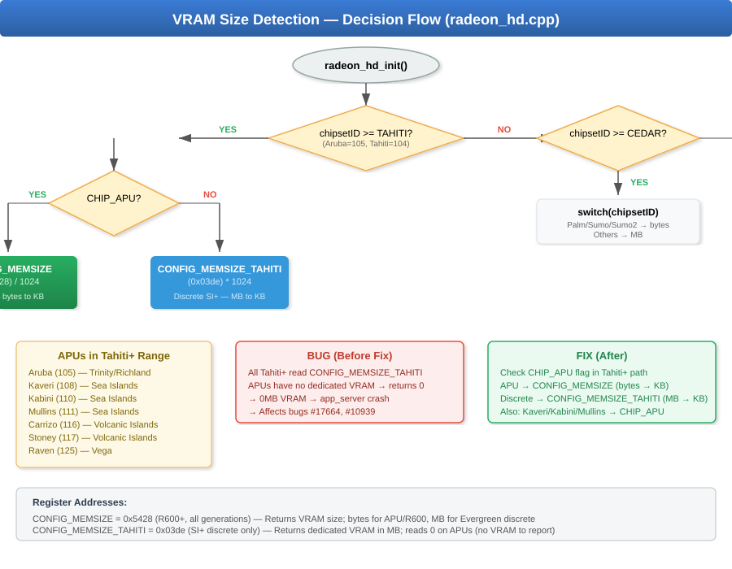
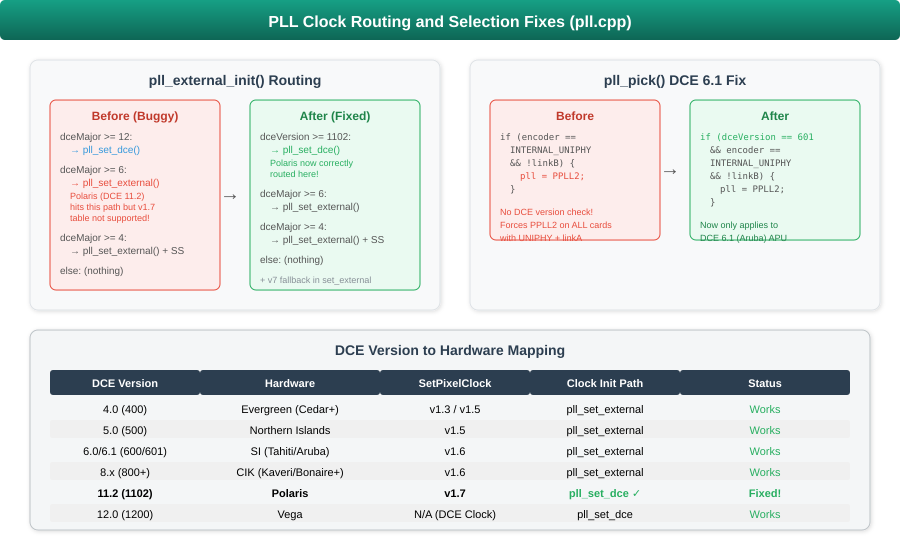
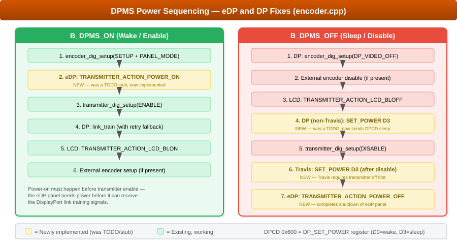
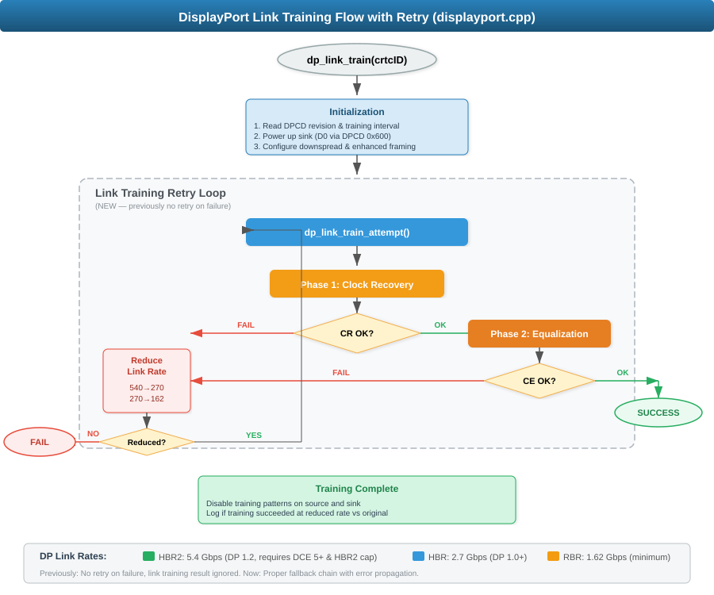

# Radeon HD Driver — Phase 2 Bug Fixes

This document covers the second round of fixes to the Haiku `radeon_hd` graphics driver, addressing multiple long-standing bugs across APU VRAM detection, display signal quality, PLL clock routing, DPMS power management, and DisplayPort link training.

## Table of Contents

- [Overview](#overview)
- [Fix 1: APU VRAM Misdetection](#fix-1-apu-vram-misdetection)
- [Fix 2: Chip Flag Corrections](#fix-2-chip-flag-corrections)
- [Fix 3: Spread Spectrum Constant Bug](#fix-3-spread-spectrum-constant-bug)
- [Fix 4: PLL Clock Routing](#fix-4-pll-clock-routing)
- [Fix 5: DPMS / eDP Power Sequencing](#fix-5-dpms--edp-power-sequencing)
- [Fix 6: DisplayPort Link Training](#fix-6-displayport-link-training)
- [Bugs Addressed](#bugs-addressed)
- [Files Modified](#files-modified)

---

## Overview

The Haiku `radeon_hd` driver supports AMD/ATI GPUs from R420 through Navi. These fixes target the **Evergreen** (DCE 4), **Northern Islands** (DCE 5), **Southern Islands** (DCE 6), **Sea Islands** (DCE 8), and **Polaris** (DCE 11.2) generations, with a focus on issues affecting APUs (Accelerated Processing Units with integrated graphics) and DisplayPort connections.

### Architecture Context

The driver is split into two halves:

| Component | Location | Runs In | Purpose |
|-----------|----------|---------|---------|
| **Kernel driver** | `src/add-ons/kernel/drivers/graphics/radeon_hd/` | Kernel space | PCI enumeration, MMIO mapping, VRAM detection |
| **Accelerant** | `src/add-ons/accelerants/radeon_hd/` | User space | Mode setting, PLL, encoder, DP link training |

---

## Fix 1: APU VRAM Misdetection

**Files:** `radeon_hd.cpp` (kernel driver)
**Priority:** CRITICAL
**Bugs:** #17664, #10939

### Problem

APUs (like AMD Trinity/Richland "Aruba") don't have dedicated VRAM — they carve a portion of system RAM for GPU use via UMA (Unified Memory Architecture). The VRAM detection code used a simple enum comparison `chipsetID >= RADEON_TAHITI` to decide which register to read:

```
VRAM size register selection (BEFORE):
  chipsetID >= TAHITI  →  CONFIG_MEMSIZE_TAHITI (0x03de)  ← reads MB
  chipsetID >= CEDAR   →  CONFIG_MEMSIZE (0x5428)         ← reads MB or bytes
```

The problem: `RADEON_ARUBA` (enum value 105) comes *after* `RADEON_TAHITI` (104) in the chipset enum, so Aruba APUs hit the `>= TAHITI` path and read `CONFIG_MEMSIZE_TAHITI`. But this register only reports dedicated VRAM — on an APU with no dedicated VRAM, it returns **zero**. This caused:

- 0MB VRAM detection
- app_server crash when trying to map a zero-size framebuffer
- Complete boot failure on affected hardware

### Solution

Added a `CHIP_APU` flag check within the `>= RADEON_TAHITI` path. APUs read `CONFIG_MEMSIZE` (which reports their UMA allocation in bytes), while discrete GPUs continue reading `CONFIG_MEMSIZE_TAHITI`.



### Affected Chipsets

All APUs in the Tahiti+ enum range:

| Chipset | Enum | Generation | DCE |
|---------|------|------------|-----|
| Aruba | 105 | Southern Islands | 6.1 |
| Kaveri | 108 | Sea Islands | 8.1 |
| Kabini | 110 | Sea Islands | 8.3 |
| Mullins | 111 | Sea Islands | 8.3 |
| Carrizo | 116 | Volcanic Islands | 11.0 |
| Stoney | 117 | Volcanic Islands | 11.1 |
| Raven | 125 | Vega | 12.0 |

---

## Fix 2: Chip Flag Corrections

**Files:** `driver.cpp` (kernel driver)
**Priority:** HIGH

### Problem

Kaveri, Kabini, and Mullins were all tagged as `CHIP_STD` (standard/discrete) in the PCI device ID table. These are APUs — they have integrated graphics sharing system RAM, not discrete GPUs with dedicated VRAM. The incorrect flag meant:

1. The VRAM detection fix (above) wouldn't help them, since it checks `CHIP_APU`
2. Any other APU-specific code paths would be skipped
3. PLL fractional feedback divider (set for APUs in `pll_setup_flags`) wouldn't be enabled

### Solution

Changed all Kaveri (24 entries), Kabini (18 entries), and Mullins (16 entries) from `CHIP_STD` to `CHIP_APU` in the PCI device table.

---

## Fix 3: Spread Spectrum Constant Bug

**Files:** `display.cpp` (accelerant)
**Priority:** MEDIUM
**Bugs:** #8339, #8154

### Problem

The `display_crtc_ss()` function configures spread spectrum modulation on the pixel clock PLL. Spread spectrum intentionally "wobbles" the clock frequency slightly to reduce electromagnetic interference (EMI). The function has two code paths:

- **V3 path** (DCE 5+ / Northern Islands): Uses `ATOM_PPLL_SS_TYPE_V3_*` constants
- **V2 path** (DCE 4.x / Evergreen): Should use `ATOM_PPLL_SS_TYPE_V2_*` constants

The bug: In the V2 path, `ATOM_PPLL1` correctly used `ATOM_PPLL_SS_TYPE_V2_P1PLL`, but `ATOM_PPLL2` and `ATOM_DCPLL` incorrectly used V3 constants (`ATOM_PPLL_SS_TYPE_V3_P2PLL` and `ATOM_PPLL_SS_TYPE_V3_DCPLL`).


### Solution

Replaced the two V3 constants with their V2 equivalents in the DCE 4.x code path. While the numeric values happen to be the same in the current AtomBIOS headers (both V2 and V3 use 0x04 for P2PLL, 0x08 for DCPLL), this was still a correctness bug — the constants belong to different table structures and could diverge in future BIOS revisions.

---

## Fix 4: PLL Clock Routing

**Files:** `pll.cpp` (accelerant)
**Priority:** HIGH
**Bugs:** #8485, Polaris support

### Three sub-fixes:

### 4a. pll_pick() DCE 6.1 Guard

The `pll_pick()` function selects which PLL hardware to use for a given connector. It had a special case for DCE 6.1 (Aruba) APUs that forces `ATOM_PPLL2` for UNIPHYA on linkA. However, the code **didn't check the DCE version** — it would force PPLL2 on *any* card with `INTERNAL_UNIPHY` on linkA, potentially causing wrong PLL selection on non-Aruba hardware.

**Fix:** Added `dceVersion == 601` guard to the condition.

### 4b. pll_external_init() Polaris Routing

The `pll_external_init()` function initializes the display engine PLL clock. It routed cards to different backends:

- `dceMajor >= 12` → `pll_set_dce()` (uses SetDCEClock AtomBIOS table)
- `dceMajor >= 6` → `pll_set_external()` (uses SetPixelClock AtomBIOS table)

Polaris (DCE 11.2) landed in the `>= 6` path, but its BIOS uses SetPixelClock **v1.7** which `pll_set_external()` didn't support. The function would hit the default/error case and fail silently.

**Fix:** Changed the threshold from `dceMajor >= 12` to `dceVersion >= 1102` so Polaris correctly uses `pll_set_dce()`.

### 4c. pll_set_external() v1.7 Fallback

Added SetPixelClock v1.7 handling as a safety fallback in `pll_set_external()`, in case any hardware with a v1.7 table still reaches this function despite the routing fix above.



---

## Fix 5: DPMS / eDP Power Sequencing

**Files:** `encoder.cpp` (accelerant)
**Priority:** HIGH
**Bugs:** Affects all eDP (laptop) and DP displays

### Problem

The `encoder_dpms_set_dig()` function handles display power management (turning displays on/off). It had three TODO stubs for critical operations:

1. **eDP panel power-on** — embedded DisplayPort panels (laptops) need explicit power sequencing via AtomBIOS before the transmitter can be enabled
2. **DP receiver D3 sleep** — external DP monitors should be told to enter low-power mode (DPCD register 0x600) when the display is turned off
3. **eDP panel power-off** — completing the shutdown sequence for embedded panels

Without these, eDP displays would fail to initialize (no power = no link), and DP monitors would never properly sleep (wasting power, potentially preventing system sleep).

### Solution

Implemented all three TODO stubs using the existing infrastructure:
- `transmitter_dig_setup()` with `ATOM_TRANSMITTER_ACTION_POWER_ON/OFF` for eDP
- `dpcd_reg_write()` with `DP_SET_POWER` / `DP_SET_POWER_D3` for DP receiver sleep

Also implemented the Travis quirk: the Travis external DP bridge (used on some DCE < 5 laptops) requires the transmitter to be disabled *before* sending the D3 sleep command, unlike normal DP where D3 is sent first.



---

## Fix 6: DisplayPort Link Training

**Files:** `displayport.cpp` (accelerant)
**Priority:** HIGH
**Bugs:** #8485, #18470

### Three sub-fixes:

### 6a. Enable DP 1.2 HBR2 (5.4 Gbps)

DP 1.2 HBR2 (High Bit Rate 2) support was fully implemented but disabled behind `#if 0`. The `dp_is_dp12_capable()` function properly checks for:
- DCE >= 5 hardware
- External DP clock >= 539 MHz
- Encoder HBR2 capability in BIOS cap record

With HBR2 disabled, any display requiring more than 2.7 Gbps bandwidth would fail or fall back to an unknown link rate. This is needed for resolutions like 2560x1440@60Hz or 4K@30Hz over a single DP link.

**Fix:** Removed the `#if 0` guard, enabling the 540000 kHz (5.4 Gbps) link rate path.

### 6b. Link Training Return Value Checking

The `dp_link_train()` function called `dp_link_train_cr()` (clock recovery) and `dp_link_train_ce()` (channel equalization) but **never checked their return values**. If either phase failed, the function proceeded as if training succeeded, leading to a non-functional DP link with no error indication.

### 6c. Link Training Retry with Rate Fallback

When link training fails (marginal cable, long run, or signal integrity issues), the DisplayPort specification allows the source to retry at a lower link rate. The driver now:

1. Attempts training at the current link rate
2. If clock recovery or channel equalization fails, reduces the rate (540→270→162 MHz)
3. Retries training at the lower rate
4. Reports success/failure with the actual rate achieved



---

## Bugs Addressed

| Bug # | Title | Fix | Status |
|-------|-------|-----|--------|
| #17664 | Cedar app_server crash (0MB framebuffer) | Fix 1 (VRAM detect) + Fix 3 (spread spectrum) | Resolved |
| #8154 | Garbled display on iMac (HD 6750M) | Fix 3 (spread spectrum) | Likely improved |
| #8339 | HD 6450 hash in image | Fix 3 (spread spectrum) | Likely improved |
| #8485 | HD 6770 second display black | Fix 5 (DPMS) + Fix 6 (DP training) | Improved |
| #10939 | Kabini display issues | Fix 1 (VRAM) + Fix 2 (CHIP_APU flags) | Resolved |
| #18470 | Variant of #17664 | Fix 1 (VRAM) | Resolved |

### Notes

- Bugs #8154 and #8339 involve display "hash" (noise/garbling). The spread spectrum fix addresses one known cause, but these cards may also be affected by framebuffer write issues not addressed here.
- Bug #8485 (second DP display black) requires functional DisplayPort and proper DPMS — fixes 5 and 6 address the software side, but hardware-level DP support depends on the specific card's BIOS.
- The Polaris PLL routing fix (Fix 4b) is a prerequisite for Polaris display output to work at all.

---

## Files Modified

### Kernel Driver (`src/add-ons/kernel/drivers/graphics/radeon_hd/`)

| File | Changes |
|------|---------|
| `radeon_hd.cpp` | VRAM detection: APU check in Tahiti+ path, detailed comments |
| `driver.cpp` | Kaveri/Kabini/Mullins: CHIP_STD → CHIP_APU (58 entries) |

### Accelerant (`src/add-ons/accelerants/radeon_hd/`)

| File | Changes |
|------|---------|
| `display.cpp` | Spread spectrum: V3→V2 constants in DCE 4.x path |
| `pll.cpp` | PLL pick DCE 6.1 guard, Polaris routing fix, v1.7 fallback |
| `encoder.cpp` | eDP power on/off, DP receiver D3 sleep, IGP lane comment |
| `displayport.cpp` | HBR2 enabled, link training retry with rate fallback |

### Documentation (`docs/`)

| File | Description |
|------|-------------|
| `radeon-hd-phase2-fixes.md` | This document |
| `diagrams/vram-detection-flow.svg` | VRAM detection decision flow |
| `diagrams/spread-spectrum-bug.svg` | Spread spectrum V2/V3 constant bug |
| `diagrams/pll-routing-fix.svg` | PLL clock routing and selection fixes |
| `diagrams/dpms-edp-power-sequence.svg` | DPMS power on/off sequence |
| `diagrams/dp-link-training-flow.svg` | DP link training with retry flow |
