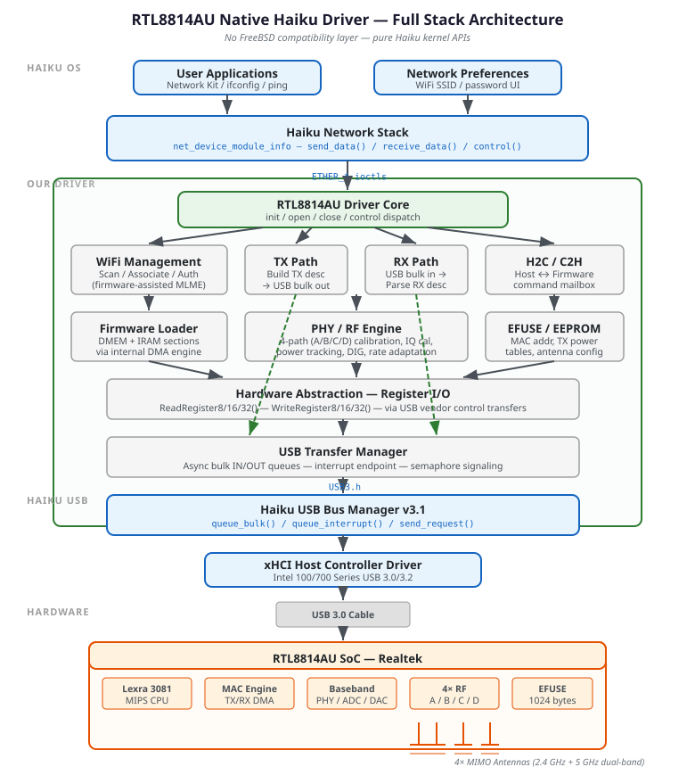
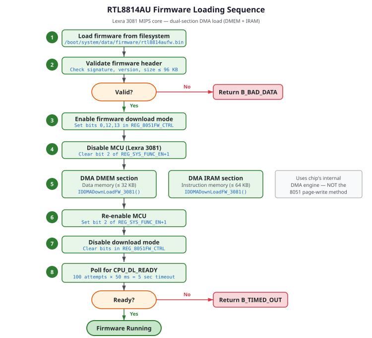
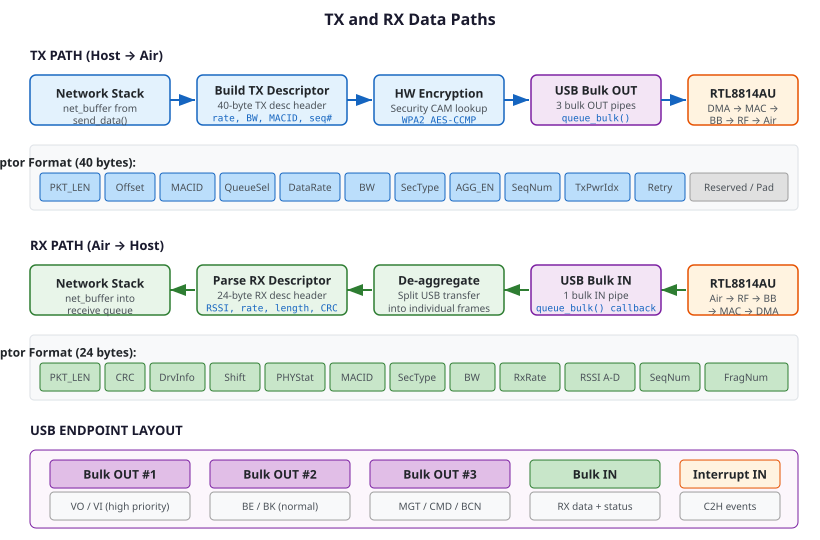
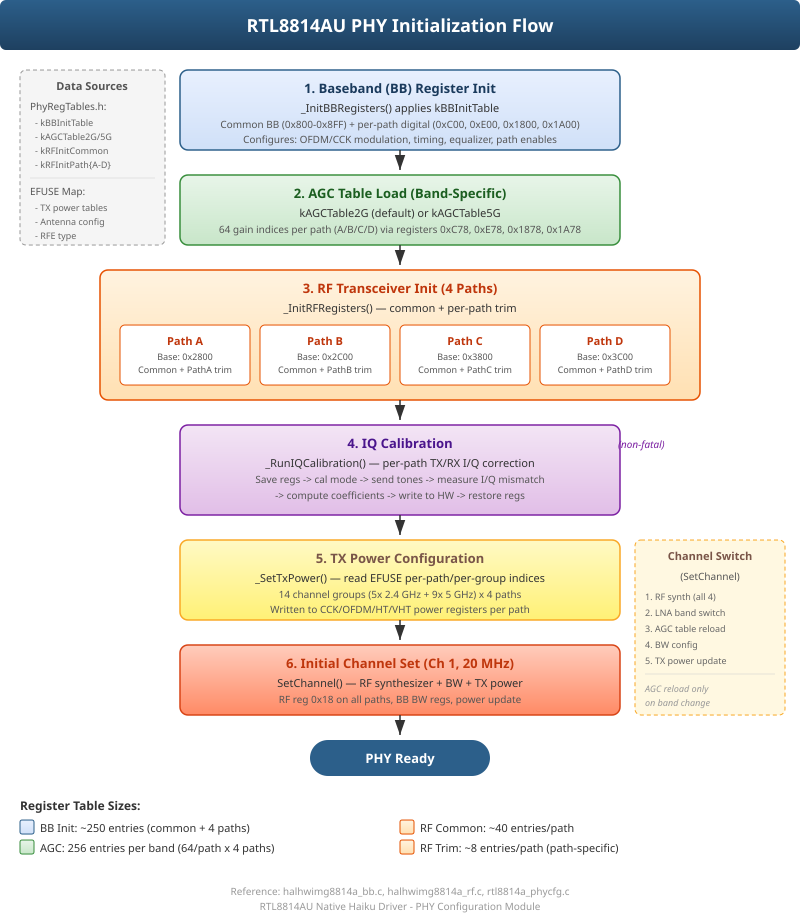
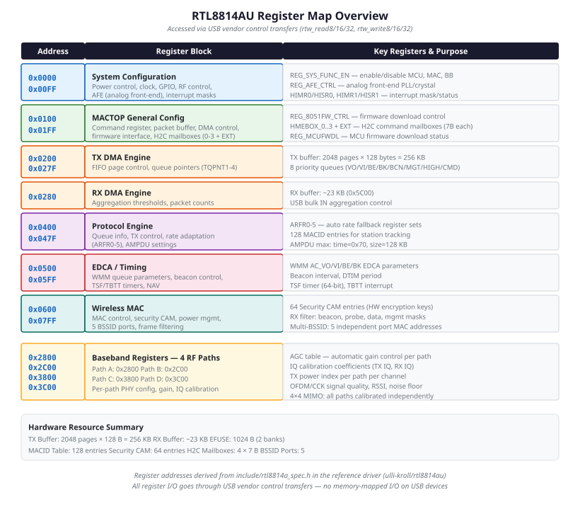

# RTL8814AU Driver Architecture

## Table of Contents

1. [Design Goals](#1-design-goals)
2. [Why a New Driver](#2-why-a-new-driver)
3. [Driver Stack](#3-driver-stack)
4. [Hardware Overview](#4-hardware-overview)
5. [Module Structure](#5-module-structure)
6. [Haiku API Integration](#6-haiku-api-integration)
7. [Firmware Loading](#7-firmware-loading)
8. [TX and RX Data Paths](#8-tx-and-rx-data-paths)
9. [WiFi Management (MLME)](#9-wifi-management-mlme)
10. [PHY and RF Engine](#10-phy-and-rf-engine)
11. [Register Map](#11-register-map)
12. [Source File Layout](#12-source-file-layout)
13. [Build System](#13-build-system)
14. [Reference Materials](#14-reference-materials)

---

## 1. Design Goals

- **Native Haiku driver.** No FreeBSD, Linux, or other OS compatibility layers.
  Uses Haiku's own USB bus manager (USB3.h v3.1), kernel module system, and
  network device interface directly.

- **Readable and well-documented.** Every source file has a top-level comment
  explaining its purpose. Non-obvious hardware interactions are commented with
  register names and reference driver cross-references.

- **Haiku coding style.** All code follows the
  [Haiku Coding Guidelines](https://www.haiku-os.org/development/coding-guidelines/):
  tabs for indentation, UpperCamelCase for types and functions, `fPrefix` for
  members, Haiku types (`int32`, `uint32`, `status_t`), explicit NULL checks,
  C++ style comments.

- **Correctness over performance.** Get it working reliably first. Optimize
  TX/RX throughput, USB aggregation, and power management later.

- **Station mode first.** Initial target is STA (client) mode to connect to
  access points. AP mode, P2P, monitor mode, and beamforming are deferred.

---

## 2. Why a New Driver

The existing Haiku `realtekwifi` driver (in `src/add-ons/kernel/drivers/network/
wlan/realtekwifi/`) is a FreeBSD `rtwn` port. It cannot support the RTL8814AU
for these reasons:

### Architectural Incompatibility

| Feature | realtekwifi (rtwn) | RTL8814AU |
|---------|-------------------|-----------|
| MCU core | Intel 8051 | Lexra 3081 (MIPS-derived) |
| FW loading | Single image, page writes | Dual-section DMA (DMEM + IRAM) |
| RF paths | 1–2 (8812AU: 2) | 4 (A, B, C, D) |
| Spatial streams | 1–2 | Up to 3 (3T4R) |
| Compat layer | FreeBSD (freebsd_network, freebsd_wlan, freebsd_usb) | N/A — native |
| 802.11 stack | FreeBSD net80211 | Firmware-assisted MLME |
| BB register base | Shared | 4 separate bases (0x2800, 0x2C00, 0x3800, 0x3C00) |

### Why Not Just Add Device IDs?

Adding RTL8814AU device IDs to the `rtwn` driver would fail at initialization
because:

1. The firmware download function uses 8051-style page writes (`rtwn_fw_loadpage`).
   The RTL8814AU requires `IDDMADownLoadFW_3081()` — a fundamentally different
   transfer mechanism using the chip's internal DMA engine.

2. The `rtwn` driver's `r12a_attach_private()` configures 2 RF paths. The
   RTL8814AU requires 4-path setup with independent BB register bases.

3. The H2C mailbox format differs (RTL8814AU uses extended mailboxes with
   different command IDs).

---

## 3. Driver Stack



The driver has six layers:

| Layer | Responsibility |
|-------|---------------|
| **Haiku Network Stack** | Delivers `net_buffer` packets to/from userland via `net_device_module_info` |
| **Driver Core** | Module lifecycle, device management, ioctl dispatch |
| **WiFi Management** | Scan, associate, authenticate via firmware-assisted MLME and H2C commands |
| **TX/RX Paths** | Build/parse hardware descriptors, manage USB bulk transfer queues |
| **Hardware Abstraction** | Register I/O (read/write 8/16/32-bit) over USB vendor control transfers |
| **USB Transfer Manager** | Async USB bulk and interrupt transfers with semaphore signaling |

---

## 4. Hardware Overview

### RTL8814AU SoC Block Diagram

The RTL8814AU is a single-chip 802.11ac solution containing:

- **Lexra 3081 CPU** — MIPS-derived core running firmware. Handles MLME state
  machine, rate adaptation, power management, and beacon processing.
- **MAC engine** — TX/RX DMA, frame filtering, security (64 CAM entries for
  hardware WPA2/AES-CCMP), 128 MACID station tracking.
- **Baseband (PHY)** — OFDM/CCK modulation, ADC/DAC, AGC, IQ calibration.
  4 independent paths with separate register bases.
- **4× RF transceivers** — Paths A/B/C/D, dual-band 2.4/5 GHz, 6 RFE
  (RF Front End) module types with different PA/LNA configurations.
- **EFUSE** — 1024 bytes of one-time-programmable memory storing MAC address,
  TX power calibration tables, antenna configuration, and regulatory data.
- **USB 2.0/3.0 interface** — 3 bulk OUT endpoints (priority-mapped), 1 bulk
  IN endpoint, 1 interrupt IN endpoint.

### Key Specifications

| Parameter | Value |
|-----------|-------|
| Standards | 802.11a/b/g/n/ac |
| Max bandwidth | 80 MHz |
| MIMO config | 4T4R antenna, 3 spatial streams (NSS=3) |
| Max PHY rate | 1.3 Gbps (80 MHz, MCS9, 3SS) |
| Bands | 2.4 GHz + 5 GHz (UNII-1/2/3) |
| Encryption | WPA2 AES-CCMP in hardware (64 keys) |
| TX buffer | 256 KB (2048 pages × 128 B) |
| MACID entries | 128 |
| USB endpoints | 3 bulk OUT + 1 bulk IN + 1 interrupt IN |
| Firmware MCU | Lexra 3081 (MIPS), DMEM ≤ 32 KB + IRAM ≤ 64 KB |
| EFUSE | 1024 bytes (2 banks) |

---

## 5. Module Structure

The driver is organized into logical modules following Haiku's driver patterns:

```
rtl8814au/
├── RTL8814AU.h              -- Master header: hardware constants, register
│                                defines, data structures shared across modules
├── Driver.h                 -- Driver-level declarations (USB hooks, device list)
├── Driver.cpp               -- Kernel module entry points: init_hardware(),
│                                init_driver(), uninit_driver(), publish_devices(),
│                                find_device()
├── Device.h                 -- RTL8814AUDevice class declaration
├── Device.cpp               -- Device lifecycle: USB attach/detach, endpoint
│                                setup, open/close/control dispatch
├── Firmware.h               -- Firmware header structures, validation, section defs
├── Firmware.cpp             -- Firmware loading: read file, validate, DMA to chip
├── RegisterIO.h             -- Register read/write function declarations
├── RegisterIO.cpp           -- USB vendor control transfer register access
├── TxPath.h                 -- TX descriptor format, queue selection
├── TxPath.cpp               -- Build TX descriptors, submit USB bulk OUT
├── RxPath.h                 -- RX descriptor format, de-aggregation
├── RxPath.cpp               -- Parse RX descriptors, deliver to network stack
├── WiFiManagement.h         -- Scan/associate/auth state machine declarations
├── WiFiManagement.cpp       -- Firmware-assisted MLME via H2C commands
├── PhyConfig.h              -- PHY/RF/BB configuration declarations
├── PhyConfig.cpp            -- 4-path RF init, calibration, channel switching,
│                                TX power configuration
├── PhyRegTables.h           -- Compiled-in BB, RF, and AGC register
│                                initialization tables (large, data-only)
├── EfuseReader.h            -- EFUSE access declarations
├── EfuseReader.cpp          -- Read EFUSE map: MAC address, TX power tables,
│                                antenna config, RFE type
├── Jamfile                  -- Build rules
└── docs/
    ├── architecture.md      -- This document
    ├── register_reference.md -- Detailed register documentation
    └── diagrams/
        ├── driver_stack.svg
        ├── register_map.svg
        ├── firmware_load.svg
        ├── tx_rx_path.svg
        └── phy_init.svg
```

### Class Hierarchy

```
RTL8814AUDevice (main device class)
  ├── fFirmware       : RTL8814AUFirmware     -- firmware load/validate
  ├── fRegisterIO     : RTL8814AURegisterIO   -- register access over USB
  ├── fTxPath         : RTL8814AUTxPath       -- TX descriptor + USB bulk out
  ├── fRxPath         : RTL8814AURxPath       -- USB bulk in + RX descriptor
  ├── fWiFiManager    : RTL8814AUWiFiManager  -- scan/assoc/auth state machine
  ├── fPhyConfig      : RTL8814AUPhyConfig    -- RF/BB calibration
  └── fEfuseReader    : RTL8814AUEfuseReader  -- EFUSE data cache
```

Each module is a separate class owned by `RTL8814AUDevice`. The device class
coordinates initialization order and teardown. Modules communicate through
the device object rather than referencing each other directly.

---

## 6. Haiku API Integration

### USB Bus Manager

The driver registers with Haiku's USB bus manager (v3.1) to detect
RTL8814AU devices:

```cpp
// Device matching by USB vendor/product ID
static usb_support_descriptor sSupportedDevices[] = {
    { 0, 0, 0, 0x0b05, 0x1817 },    // ASUS USB-AC68
    { 0, 0, 0, 0x7392, 0xa833 },    // Edimax AC1750
};
```

When a matching device is plugged in, `device_added()` is called. The driver:

1. Gets the device descriptor and configuration
2. Sets the active USB configuration
3. Iterates interfaces to find bulk IN/OUT and interrupt endpoints
4. Creates an `RTL8814AUDevice` instance
5. Publishes the device name to `/dev/net/rtl8814au/N`

### Network Device Interface

The driver exports a `net_device_module_info` structure so the Haiku network
stack can send and receive packets:

| Callback | Our Implementation |
|----------|-------------------|
| `init_device()` | Power on chip, load firmware, init MAC/BB/RF |
| `up()` | Enable RX, start bulk IN queue, set RX filter |
| `down()` | Disable RX, cancel pending USB transfers |
| `send_data()` | Build TX descriptor, queue USB bulk OUT |
| `receive_data()` | Return next frame from RX ring buffer |
| `control()` | Handle `ETHER_GETADDR`, `ETHER_GET_LINK_STATE`, scan trigger |
| `set_mtu()` | Update MAC frame size register |

### Device Hooks

For the character device interface (`/dev/net/rtl8814au/N`), the driver
provides standard Haiku `device_hooks`:

- `open` / `close` / `free` — reference counting on the device
- `control` — ioctl dispatch (link state, scan results, association)
- `read` / `write` — bulk data (used by the network stack via `net_device`)

---

## 7. Firmware Loading



The RTL8814AU uses a **Lexra 3081 MIPS-derived core**, not the simpler 8051
found in older Realtek chips. This requires a different firmware loading
mechanism:

### Firmware Binary Format

The firmware file (`rtl8814aufw.bin`, ≤ 96 KB) contains two sections:

| Section | Purpose | Max Size |
|---------|---------|----------|
| DMEM | Data memory (initialized variables, tables) | 32 KB |
| IRAM | Instruction memory (executable code) | 64 KB |

### Loading Sequence

1. **Read firmware** from `/boot/system/data/firmware/rtl8814aufw.bin`
2. **Validate** header signature, version, and total size ≤ 96 KB
3. **Enable download mode** — set bits in `REG_8051FW_CTRL_8814A`
4. **Halt the MCU** — clear bit 2 of `REG_SYS_FUNC_EN_8814A + 1`
5. **DMA both sections** — `IDDMADownLoadFW_3081()` transfers DMEM and IRAM
   through the chip's internal DMA engine (not USB bulk transfer)
6. **Resume the MCU** — set bit 2 of `REG_SYS_FUNC_EN_8814A + 1`
7. **Disable download mode**
8. **Poll for ready** — check `CPU_DL_READY` flag (100 × 50 ms = 5 sec timeout)

### Firmware File Location

On Haiku, firmware files live under `/boot/system/data/firmware/`. The driver
opens the file directly using Haiku's VFS (`open()` / `read()` / `close()`).
No FreeBSD `firmware_get()` compat is needed.

---

## 8. TX and RX Data Paths



### TX Path (Host → Air)

1. **Network stack** calls `send_data()` with a `net_buffer`
2. **Build TX descriptor** — 40-byte header prepended to frame:
   - Packet length, offset, MACID, queue select
   - Data rate, bandwidth, security type
   - Aggregation enable, sequence number, TX power index, retry limit
3. **Queue selection** — map WMM priority to one of 3 bulk OUT endpoints:
   - OUT #1: VO/VI (voice/video — high priority)
   - OUT #2: BE/BK (best effort/background — normal traffic)
   - OUT #3: MGT/CMD/BCN (management frames, H2C commands, beacons)
4. **USB bulk OUT** — submit via `queue_bulk()`, callback signals completion
5. **Hardware** DMA moves the frame through MAC → BB → RF → antenna

### RX Path (Air → Host)

1. **Hardware** receives frame: antenna → RF → BB → MAC → DMA
2. **USB bulk IN** — aggregated frames arrive via bulk IN callback
3. **De-aggregate** — split USB transfer into individual frames
4. **Parse RX descriptor** — 24-byte header contains:
   - Packet length, CRC status, driver info offset
   - PHY status, MACID, security type
   - Bandwidth, RX rate, per-path RSSI (A/B/C/D)
   - Sequence and fragment numbers
5. **Deliver to network stack** — wrap payload in `net_buffer`, enqueue

### USB Endpoint Mapping

The RTL8814AU exposes 5 USB endpoints:

| Endpoint | Type | Direction | Purpose |
|----------|------|-----------|---------|
| Bulk OUT #1 | Bulk | OUT | High-priority TX (VO/VI) |
| Bulk OUT #2 | Bulk | OUT | Normal TX (BE/BK) |
| Bulk OUT #3 | Bulk | OUT | Management TX (MGT/CMD/BCN) |
| Bulk IN | Bulk | IN | RX data + status |
| Interrupt IN | Interrupt | IN | C2H firmware events |

---

## 9. WiFi Management (MLME)

The RTL8814AU firmware runs a full MLME (MAC Layer Management Entity) state
machine on its Lexra 3081 core. The host driver does NOT need to implement
low-level 802.11 frame exchanges — instead it sends high-level commands via
the H2C (Host-to-Card) mailbox system.

### H2C Mailbox System

- 4 rotating mailboxes (HMEBOX_0 through HMEBOX_3)
- Each mailbox: 4 standard bytes + 4 extended bytes = 7 usable bytes
- The driver writes a command to the next available mailbox and bumps the
  write pointer
- The firmware reads the command, processes it, and optionally sends a C2H
  (Card-to-Host) response via the interrupt IN endpoint

### Key H2C Commands

| Command | Purpose |
|---------|---------|
| SetPowerMode | Enter/exit power saving (IPS/LPS) |
| SetMediaStatus | Report connection/disconnection to firmware |
| SetRateAdaptive | Configure rate adaptation parameters |
| SetChannel | Switch operating channel and bandwidth |
| ScanOffload | Trigger firmware-assisted scan |
| SetSecurity | Configure per-station encryption keys |
| SetBeacon | Set beacon parameters (AP mode, future) |

### Scan Flow

1. Driver sends `ScanOffload` H2C with channel list and dwell times
2. Firmware iterates channels, sends probe requests, collects responses
3. Firmware sends `ScanComplete` C2H event with results
4. Driver parses results and caches BSS list
5. Userland queries scan results via ioctl

### Association Flow

1. Userland triggers association via ioctl (SSID + credentials)
2. Driver sends `Authenticate` H2C to firmware
3. Firmware handles 802.11 auth frame exchange
4. Driver sends `Associate` H2C
5. Firmware handles assoc request/response
6. On success, firmware sends `ConnectionStatus` C2H
7. Driver configures security keys, enables data path

---

## 10. PHY and RF Engine



### 4-Path Configuration

The RTL8814AU has 4 independent RF/BB paths. Each path has its own:

- Baseband register base (A: 0x2800, B: 0x2C00, C: 0x3800, D: 0x3C00)
- AGC (Automatic Gain Control) table
- IQ calibration coefficients
- TX power index
- RSSI measurement

### Initialization Sequence

1. **Read EFUSE** — get antenna configuration, RFE type, TX power tables
2. **Load BB register tables** — chip-specific baseband configuration from
   compiled-in tables (derived from reference driver's PHY config files)
3. **Load RF register tables** — per-path radio configuration
4. **IQ calibration** — run TX/RX IQ mismatch calibration for each path
5. **Set TX power** — per-path, per-channel from EFUSE tables
6. **Start PHY-DM** — enable dynamic mechanisms:
   - DIG (Dynamic Initial Gain) — adjust receiver sensitivity
   - Power tracking — compensate TX power drift with temperature
   - Rate adaptation — firmware-driven, configured via H2C

### Channel Switching

Changing the operating channel requires:

1. Set channel number and bandwidth in BB registers
2. Reconfigure RF synthesizer for each of the 4 paths
3. Reload AGC tables if switching between 2.4 GHz and 5 GHz bands
4. Re-apply TX power settings for the new channel
5. Optionally re-run IQ calibration (if band changed)

---

## 11. Register Map



All register access goes through USB vendor control transfers. The driver
provides `ReadRegister8()`, `ReadRegister16()`, `ReadRegister32()` and matching
write functions that wrap `gUSBModule->send_request()`.

See [register_reference.md](register_reference.md) for detailed per-register
documentation.

---

## 12. Source File Layout

```
src/add-ons/kernel/drivers/network/wlan/rtl8814au/
├── docs/                     -- Documentation (this file, register ref, diagrams)
│   ├── architecture.md
│   ├── register_reference.md
│   └── diagrams/
│       ├── driver_stack.svg
│       ├── register_map.svg
│       ├── firmware_load.svg
│       ├── tx_rx_path.svg
│       └── phy_init.svg
├── RTL8814AU.h               -- Master header with hardware constants
├── Driver.h / .cpp           -- Kernel module entry points
├── Device.h / .cpp           -- USB device class (lifecycle, endpoint setup)
├── Firmware.h / .cpp         -- Firmware loading
├── RegisterIO.h / .cpp       -- Register I/O over USB control transfers
├── TxPath.h / .cpp           -- TX descriptor + USB bulk OUT
├── RxPath.h / .cpp           -- USB bulk IN + RX descriptor parsing
├── WiFiManagement.h / .cpp   -- Scan/associate/auth via H2C/C2H
├── PhyConfig.h / .cpp        -- RF/BB init, calibration, channel switch
├── PhyRegTables.h            -- BB, RF, AGC register init tables
├── EfuseReader.h / .cpp      -- EFUSE access and parsing
└── Jamfile                   -- Build rules
```

---

## 13. Build System

The driver uses Haiku's Jam-based build system. The `Jamfile` will:

- Compile all `.cpp` source files
- Link against Haiku kernel modules: `libkernellandlib.a`
- Include system headers from `headers/os/drivers/` and `headers/private/net/`
- Install the built driver to `add-ons/kernel/drivers/bin/` with a symlink
  from `add-ons/kernel/drivers/dev/net/`

No FreeBSD compatibility libraries are linked.

---

## 14. Reference Materials

### Primary Hardware Reference

- **ulli-kroll/rtl8814au** (GitHub) — Linux vendor driver (GPLv2). The
  authoritative source for:
  - Register addresses and bit definitions (`include/rtl8814a_spec.h`)
  - Firmware loading protocol (`hal/rtl8814a/rtl8814a_hal_init.c`)
  - TX/RX descriptor formats (`hal/rtl8814a/rtl8814a_xmit.c`, `rtl8814a_rxdesc.c`)
  - PHY/RF initialization tables (`hal/phydm/rtl8814a/`)
  - H2C/C2H command definitions (`hal/rtl8814a/rtl8814a_cmd.c`)
  - EFUSE map layout and parsing
  - Power-on/off sequencing (`hal/rtl8814a/Hal8814PwrSeq.c`)

  No code is copied directly. Register definitions and hardware behavior are
  re-implemented natively for Haiku.

### Haiku APIs

- **USB3.h** (v3.1) — USB bus manager: device registration, async transfers
- **net_device.h** — Network device module interface
- **ether_driver.h** — Ethernet/WiFi ioctl definitions
- **net_buffer.h** — Zero-copy packet buffer management
- **KernelExport.h** — Semaphores, mutexes, spinlocks, DPC
- **module.h** — Kernel module lifecycle

### Haiku Driver Examples

- **usb_davicom** (`src/add-ons/kernel/drivers/network/ether/usb_davicom/`)
  — Clean native USB Ethernet driver pattern
- **usb_ecm** (`src/add-ons/kernel/drivers/network/ether/usb_ecm/`)
  — Modern device manager pattern for USB networking
- **usb_hid** (`src/add-ons/kernel/drivers/input/usb_hid/`)
  — USB device enumeration and async transfer patterns
